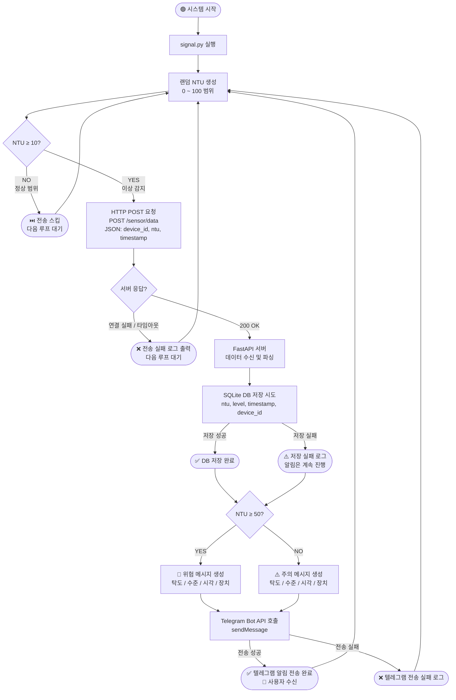
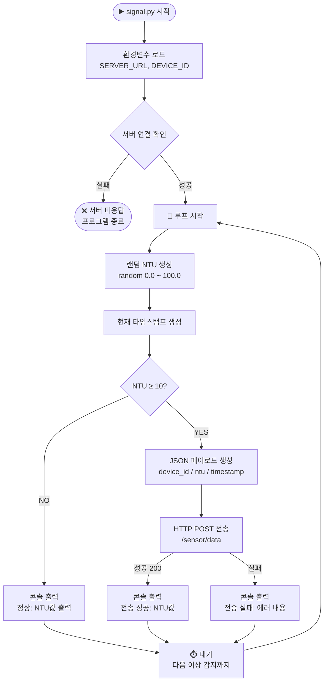
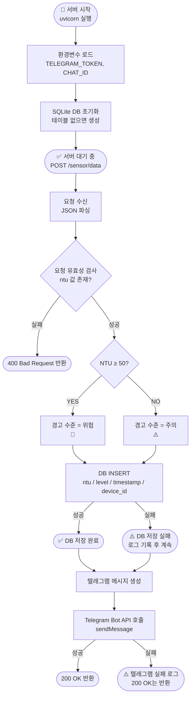
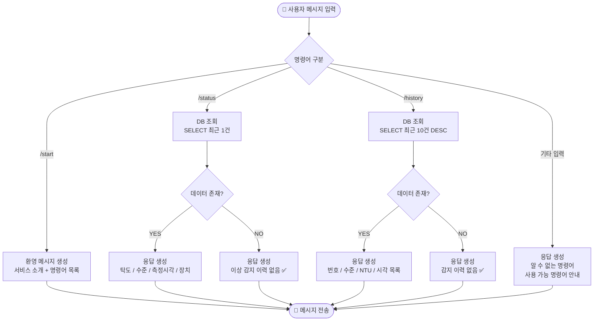
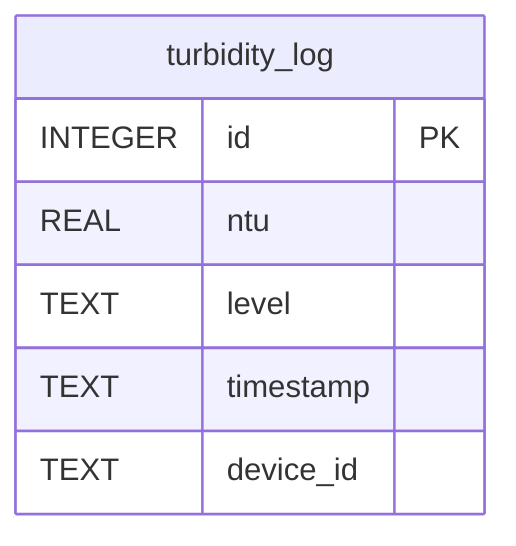

# 플로우차트
## 수조 수질 탁도 감지 및 텔레그램 즉시 알림 서비스

---

## 1. 전체 시스템 흐름

```mermaid
flowchart TD
    A([🟢 시스템 시작]) --> B[signal.py 실행]
    B --> C[랜덤 NTU 생성\n0 ~ 100 범위]
    C --> D{NTU ≥ 10?}

    D -- NO\n정상 범위 --> E([⏭️ 전송 스킵\n다음 루프 대기])
    E --> C

    D -- YES\n이상 감지 --> F[HTTP POST 요청\nPOST /sensor/data\nJSON: device_id, ntu, timestamp]

    F --> G{서버 응답?}
    G -- 연결 실패 / 타임아웃 --> H([❌ 전송 실패 로그 출력\n다음 루프 대기])
    H --> C

    G -- 200 OK --> I[FastAPI 서버\n데이터 수신 및 파싱]

    I --> J[SQLite DB 저장 시도\nntu, level, timestamp, device_id]
    J -- 저장 성공 --> K([✅ DB 저장 완료])
    J -- 저장 실패 --> L([⚠️ 저장 실패 로그\n알림은 계속 진행])

    K --> M{NTU ≥ 50?}
    L --> M

    M -- YES --> N[🚨 위험 메시지 생성\n탁도 / 수준 / 시각 / 장치]
    M -- NO --> O[⚠️ 주의 메시지 생성\n탁도 / 수준 / 시각 / 장치]

    N --> P[Telegram Bot API 호출\nsendMessage]
    O --> P

    P -- 전송 성공 --> Q([✅ 텔레그램 알림 전송 완료\n👤 사용자 수신])
    P -- 전송 실패 --> R([❌ 텔레그램 전송 실패 로그])

    Q --> C
    R --> C
```

---

## 2. signal.py 상세 흐름

```mermaid
flowchart TD
    A([▶️ signal.py 시작]) --> B[환경변수 로드\nSERVER_URL, DEVICE_ID]
    B --> C{서버 연결 확인}
    C -- 실패 --> D([❌ 서버 미응답\n프로그램 종료])
    C -- 성공 --> E[🔁 루프 시작]

    E --> F[랜덤 NTU 생성\nrandom 0.0 ~ 100.0]
    F --> G[현재 타임스탬프 생성]
    G --> H{NTU ≥ 10?}

    H -- NO --> I[콘솔 출력\n정상: NTU값 출력]
    I --> J[⏱️ 대기\n다음 이상 감지까지]
    J --> E

    H -- YES --> K[JSON 페이로드 생성\ndevice_id / ntu / timestamp]
    K --> L[HTTP POST 전송\n/sensor/data]

    L -- 성공 200 --> M[콘솔 출력\n전송 성공: NTU값]
    L -- 실패 --> N[콘솔 출력\n전송 실패: 에러 내용]

    M --> J
    N --> J
```

---

## 3. FastAPI 서버 상세 흐름

```mermaid
flowchart TD
    A([🚀 서버 시작\nuvicorn 실행]) --> B[환경변수 로드\nTELEGRAM_TOKEN, CHAT_ID]
    B --> C[SQLite DB 초기화\n테이블 없으면 생성]
    C --> D([✅ 서버 대기 중\nPOST /sensor/data])

    D --> E[요청 수신\nJSON 파싱]
    E --> F{요청 유효성 검사\nntu 값 존재?}

    F -- 실패 --> G([400 Bad Request 반환])
    F -- 성공 --> H{NTU ≥ 50?}

    H -- YES --> I[경고 수준 = 위험\n🚨]
    H -- NO --> J[경고 수준 = 주의\n⚠️]

    I --> K[DB INSERT\nntu / level / timestamp / device_id]
    J --> K

    K -- 성공 --> L([✅ DB 저장 완료])
    K -- 실패 --> M([⚠️ DB 저장 실패\n로그 기록 후 계속])

    L --> N[텔레그램 메시지 생성]
    M --> N

    N --> O[Telegram Bot API 호출\nsendMessage]
    O -- 성공 --> P([200 OK 반환])
    O -- 실패 --> Q([⚠️ 텔레그램 실패 로그\n200 OK는 반환])
```

---

## 4. 텔레그램 봇 명령어 상세 흐름

```mermaid
flowchart TD
    A([👤 사용자 메시지 입력]) --> B{명령어 구분}

    B -- /start --> C[환영 메시지 생성\n서비스 소개 + 명령어 목록]
    C --> D([📨 메시지 전송])

    B -- /status --> E[DB 조회\nSELECT 최근 1건]
    E --> F{데이터 존재?}
    F -- YES --> G[응답 생성\n탁도 / 수준 / 측정시각 / 장치]
    F -- NO --> H[응답 생성\n이상 감지 이력 없음 ✅]
    G --> D
    H --> D

    B -- /history --> I[DB 조회\nSELECT 최근 10건 DESC]
    I --> J{데이터 존재?}
    J -- YES --> K[응답 생성\n번호 / 수준 / NTU / 시각 목록]
    J -- NO --> L[응답 생성\n감지 이력 없음 ✅]
    K --> D
    L --> D

    B -- 기타 입력 --> M[응답 생성\n알 수 없는 명령어\n사용 가능 명령어 안내]
    M --> D
```

---

## 5. DB 저장 구조

```mermaid
erDiagram
    turbidity_log {
        INTEGER id PK
        REAL ntu
        TEXT level
        TEXT timestamp
        TEXT device_id
    }
```
