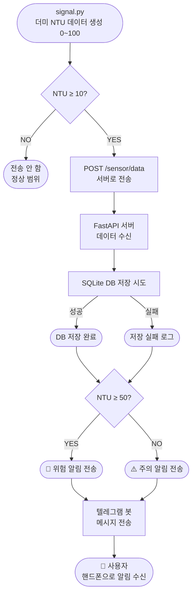
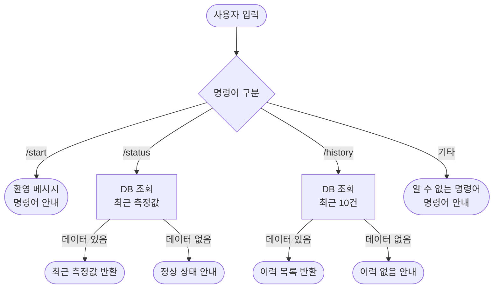
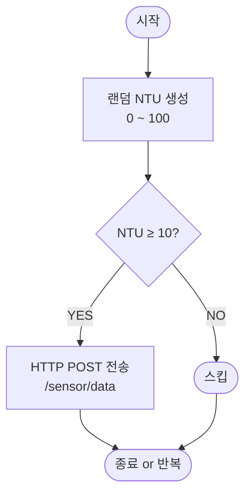

# 플로우차트
## 수조 수질 탁도 감지 및 텔레그램 즉시 알림 서비스

---

## 1. 전체 시스템 흐름

```mermaid
flowchart TD
    A([signal.py\n더미 NTU 데이터 생성 0~100]) --> B{NTU ≥ 10?}
    B -- NO --> C([전송 안 함\n정상 범위])
    B -- YES --> D[POST /sensor/data\n서버로 전송]
    D --> E[FastAPI 서버\n데이터 수신]
    E --> F[SQLite DB 저장 시도]
    F -- 성공 --> G([DB 저장 완료])
    F -- 실패 --> H([저장 실패 로그])
    G --> I{NTU ≥ 50?}
    H --> I
    I -- YES --> J([🚨 위험 알림 전송])
    I -- NO --> K([⚠️ 주의 알림 전송])
    J --> L[텔레그램 봇\n메시지 전송]
    K --> L
    L --> M([👤 사용자\n핸드폰으로 알림 수신])
```

---

## 2. 텔레그램 봇 명령어 흐름

```mermaid
flowchart TD
    A([사용자 입력]) --> B{명령어 구분}
    B -- /start --> C([환영 메시지\n명령어 안내])
    B -- /status --> D[DB 조회\n최근 측정값]
    D -- 데이터 있음 --> E([최근 측정값 반환])
    D -- 데이터 없음 --> F([정상 상태 안내])
    B -- /history --> G[DB 조회\n최근 10건]
    G -- 데이터 있음 --> H([이력 목록 반환])
    G -- 데이터 없음 --> I([이력 없음 안내])
    B -- 기타 --> J([알 수 없는 명령어\n명령어 안내])
```

---

## 3. signal.py 내부 흐름

```mermaid
flowchart TD
    A([시작]) --> B[랜덤 NTU 생성\n0 ~ 100]
    B --> C{NTU ≥ 10?}
    C -- YES --> D[HTTP POST 전송\n/sensor/data]
    C -- NO --> E([스킵])
    D --> F([종료 or 반복])
    E --> F
```
