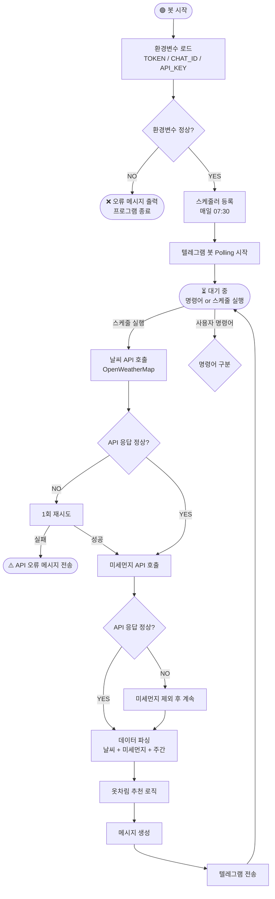
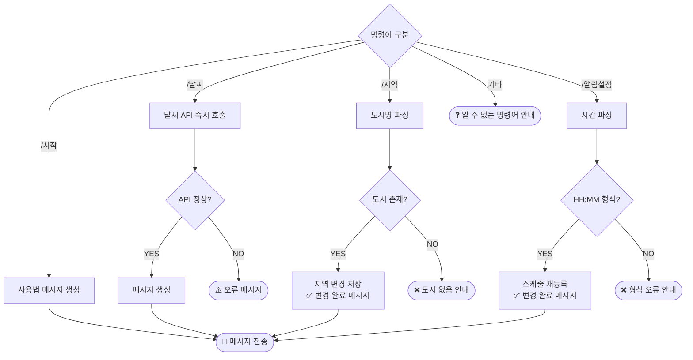
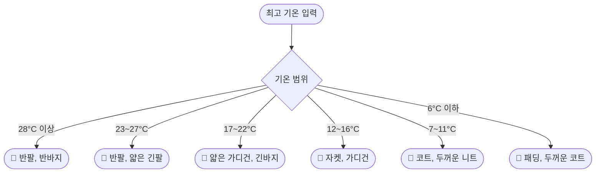
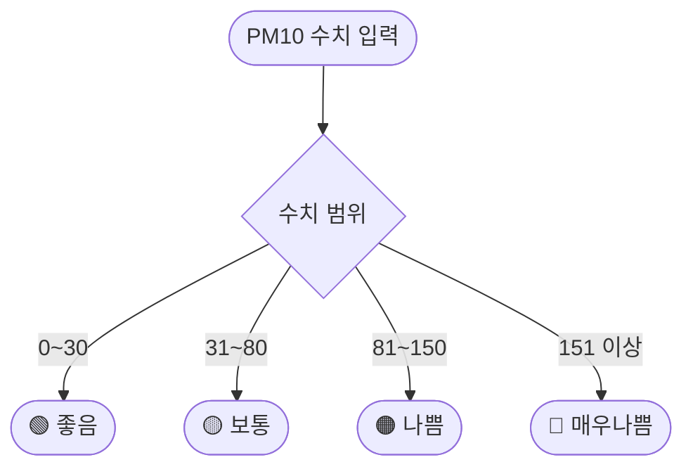
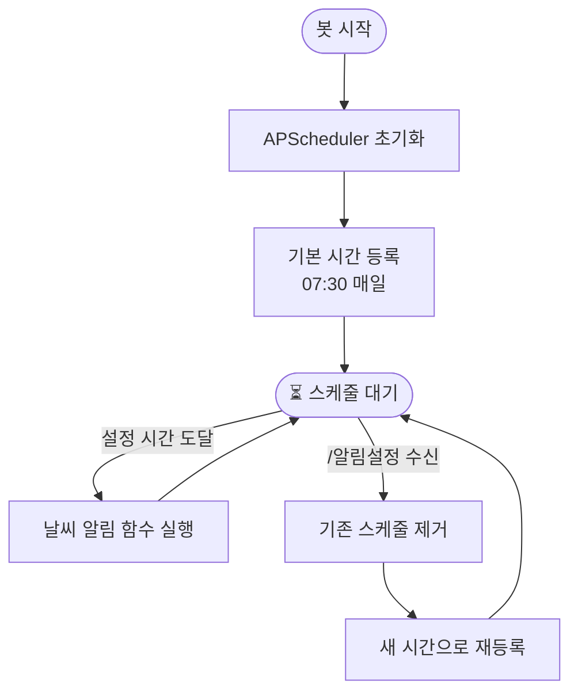

# 플로우차트
## 날씨 자동 알림 텔레그램 봇

---

## 1. 전체 시스템 흐름

```mermaid
flowchart TD
    A([🟢 봇 시작]) --> B[환경변수 로드\nTOKEN / CHAT_ID / API_KEY]
    B --> C{환경변수 정상?}
    C -- NO --> D([❌ 오류 메시지 출력\n프로그램 종료])
    C -- YES --> E[스케줄러 등록\n매일 07:30]
    E --> F[텔레그램 봇 Polling 시작]
    F --> G([⏳ 대기 중\n명령어 or 스케줄 실행])

    G -- 스케줄 실행 --> H[날씨 API 호출\nOpenWeatherMap]
    G -- 사용자 명령어 --> P{명령어 구분}

    H --> I{API 응답 정상?}
    I -- NO --> J[1회 재시도]
    J -- 실패 --> K([⚠️ API 오류 메시지 전송])
    J -- 성공 --> L[미세먼지 API 호출]
    I -- YES --> L

    L --> M{API 응답 정상?}
    M -- NO --> N[미세먼지 제외 후 계속]
    M -- YES --> O[데이터 파싱\n날씨 + 미세먼지 + 주간]

    N --> O
    O --> O2[옷차림 추천 로직]
    O2 --> O3[메시지 생성]
    O3 --> O4[텔레그램 전송]
    O4 --> G
```

---

## 2. 명령어 처리 흐름

```mermaid
flowchart TD
    P{명령어 구분} -- /시작 --> Q[사용법 메시지 생성]
    P -- /날씨 --> R[날씨 API 즉시 호출]
    P -- /지역 --> S[도시명 파싱]
    P -- /알림설정 --> T[시간 파싱]
    P -- 기타 --> U([❓ 알 수 없는 명령어 안내])

    Q --> Z([📨 메시지 전송])

    R --> R1{API 정상?}
    R1 -- YES --> R2[메시지 생성]
    R1 -- NO --> R3([⚠️ 오류 메시지])
    R2 --> Z

    S --> S1{도시 존재?}
    S1 -- YES --> S2[지역 변경 저장\n✅ 변경 완료 메시지]
    S1 -- NO --> S3([❌ 도시 없음 안내])
    S2 --> Z

    T --> T1{HH:MM 형식?}
    T1 -- YES --> T2[스케줄 재등록\n✅ 변경 완료 메시지]
    T1 -- NO --> T3([❌ 형식 오류 안내])
    T2 --> Z
```

---

## 3. 옷차림 추천 로직

```mermaid
flowchart TD
    A([최고 기온 입력]) --> B{기온 범위}
    B -- 28°C 이상 --> C([👕 반팔, 반바지])
    B -- 23~27°C --> D([👔 반팔, 얇은 긴팔])
    B -- 17~22°C --> E([🧥 얇은 가디건, 긴바지])
    B -- 12~16°C --> F([🧣 자켓, 가디건])
    B -- 7~11°C --> G([🧤 코트, 두꺼운 니트])
    B -- 6°C 이하 --> H([🧥 패딩, 두꺼운 코트])
```

---

## 4. 미세먼지 등급 판단 로직

```mermaid
flowchart TD
    A([PM10 수치 입력]) --> B{수치 범위}
    B -- 0~30 --> C([🟢 좋음])
    B -- 31~80 --> D([🟡 보통])
    B -- 81~150 --> E([🟠 나쁨])
    B -- 151 이상 --> F([🔴 매우나쁨])
```

---

## 5. 스케줄러 흐름

```mermaid
flowchart TD
    A([봇 시작]) --> B[APScheduler 초기화]
    B --> C[기본 시간 등록\n07:30 매일]
    C --> D([⏳ 스케줄 대기])
    D -- 설정 시간 도달 --> E[날씨 알림 함수 실행]
    E --> D
    D -- /알림설정 수신 --> F[기존 스케줄 제거]
    F --> G[새 시간으로 재등록]
    G --> D
```
